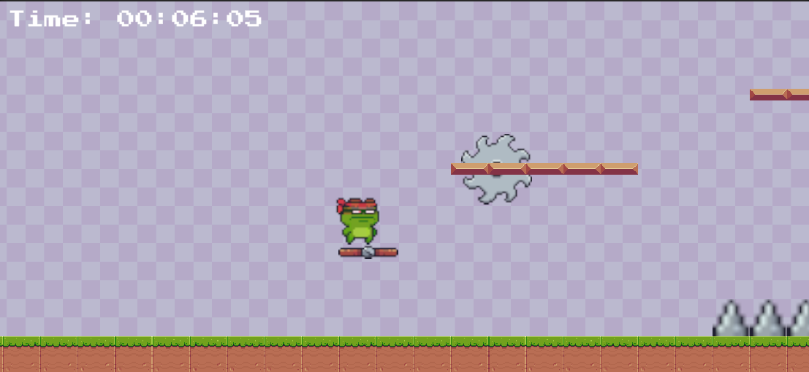

# Unity Minigame for LockCube
A Unity Minigame to be run on the LockCube when the user begins scrolling. The initial files for the initial commit was generated by Unity.

## Description
LockCube is a project for HackDuke 2026 which helps people break out of the cycle of phone-related distractions. This game will draw people away from their phone for a short period of time before returning back to their original work. The game is a simple and short 2D platformer game where the player tries to reach the right side of the screen in the shortest period possible. Avoid various obstacles and show off your parkour skills to become the best LockCube gamer there is!



## Technical Details
This game was developed using Unity 6000.3.9f1, and this is built to Linux x86_64 to be run on a Raspberry Pi using Box64.

## Setup
First, clone the directory using
```
git clone git@github.com:AnthonZh/LockCubeMiniGame.git
```
Then, open the cloned directory using Unity Editor 6000.3.9f1 and install the necessary packages.

## AI Contribution
Large Languages Models were used to assist in creating this Minigame. Claude AI was used for questions about certain Unity Contents, in particular input management, camera boundaries, and linear interpolations.

## Attributions
The [Pixel Adventure Assets](https://pixelfrog-assets.itch.io/pixel-adventure-1) used in this project were created by Pixel Frog under the Creative Commons Zero license. The font, [Press Font](https://www.fontspace.com/press-start-2p-font-f11591) designed by codeman38 is licensed under the SIL Open Font License. All sounds are from [Pixabay.com](https://pixabay.com/)